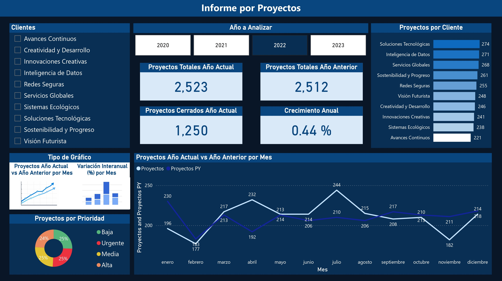
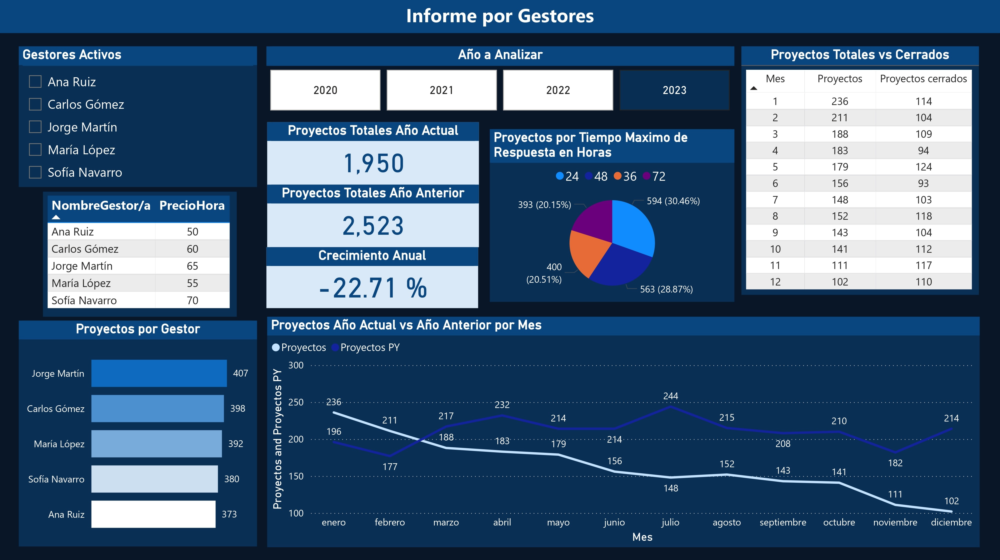

# 📊 Análisis Operativo de Tickets de Servicio – ServiTech


---

## 💡 Problema que resuelve

ServiTech no contaba con indicadores claros para evaluar tendencias, comparar períodos ni detectar patrones de actividad. El proyecto centralizó más de 9.000 solicitudes, permitió comparar el volumen de proyectos año a año, identificar gestores con mayor carga y visualizar los proyectos abiertos que aún no tienen cierre registrado.

---

## 🏢 Contexto del negocio

ServiTech es una empresa del sector tecnológico que brinda soporte técnico a sus clientes. Se analizan **9.387 solicitudes de servicio** registradas entre 2020 y 2023, con información de clientes, gestores, prioridades, categorías y fechas de apertura y cierre.

---

## 🎯 Objetivo

Construir un reporte interactivo en Power BI que permita monitorear la evolución de los proyectos, comparar períodos anuales y analizar el desempeño por gestor y cliente.

---

## 📸 Vista del reporte

### Portada con navegación


### Informe por Proyectos


### Informe por Gestores


---

## 📋 Estructura del reporte

El reporte está organizado en **3 páginas** con navegación dinámica mediante botones con marcadores:

| Página | Contenido |
|---|---|
| **Portada** | Presentación con navegación hacia Informe por Proyectos e Informe por Gestores |
| **Informe por Proyectos** | Proyectos totales año actual y anterior, crecimiento anual, proyectos cerrados, comparación mensual con año anterior y distribución por cliente y prioridad |
| **Informe por Gestores** | Proyectos totales vs. cerrados por mes, distribución por gestor, precio/hora y tiempo máximo de respuesta |

---

## ✅ Resultados clave (año 2022)

| Métrica | Valor |
|---|---|
| Proyectos totales año actual | 2.523 |
| Proyectos totales año anterior | 2.512 |
| Crecimiento anual | **+0,44%** |
| Proyectos cerrados año actual | 1.250 |
| Cliente con más proyectos | Soluciones Tecnológicas (274) |
| Distribución por prioridad | Equitativa: ~25% en cada nivel |
| Gestor con más proyectos | Jorge Martín (407) |
| Precio/hora más alto | Sofía Navarro ($70) |

---

## ⚙️ Medidas DAX implementadas

```dax
-- Conteo de proyectos
Proyectos = COUNTROWS(Solicitudes)

-- Proyectos del año anterior (inteligencia de tiempo)
Proyectos PY =
CALCULATE(
    [Proyectos],
    SAMEPERIODLASTYEAR(Fechas[Fecha])
)

-- Variación interanual porcentual
Proyectos YoY % =
DIVIDE(
    [Proyectos] - [Proyectos PY],
    [Proyectos PY]
)

-- Proyectos cerrados usando relación inactiva
Proyectos cerrados =
CALCULATE(
    [Proyectos],
    USERELATIONSHIP(Fechas[Fecha], Solicitudes[FechaCierre]),
    NOT ISBLANK(Solicitudes[FechaCierre])
)
```

**`USERELATIONSHIP`** permitió analizar simultáneamente proyectos por fecha de apertura (relación activa) y por fecha de cierre (relación inactiva), sin eliminar ninguna de las dos conexiones del modelo.

---

## 🔧 Otras técnicas aplicadas

- Modelado relacional con 6 tablas conectadas (Solicitudes, Cliente, Estado, Gestor/a, Prioridad, Categoría, Fechas)
- Detección automática de relaciones y corrección manual de las no detectadas
- Segmentación de datos con selección única forzada (`Forzar selección`)
- Formato condicional por reglas en gráfico de columnas (positivo/negativo)
- Línea de referencia constante en eje Y
- Navegación entre vistas con marcadores (`Columnas` / `Líneas`)
- Diseño de fondo personalizado con plantilla importada como imagen

---

## 🔗 Acceso al proyecto

👉 [Ver reporte interactivo en Power BI](https://app.powerbi.com/view?r=eyJrIjoiMTk3ZDZjZmMtZTJhMS00Mzk5LWFiN2QtZDE5NTRmOWZmYmRiIiwidCI6IjQ5ZmVkNjk3LTAxZmYtNDJkNi1hNWEzLTZlNjViYTcwZDg5ZSIsImMiOjR9&pageName=bff729c211f7680b64d3)  
👉 [Descargar archivo .pbix](https://drive.google.com/file/d/1sEeALqKlUdaNM1xZvX8mB7Ah5YfaYlPo/view)

---

## 👩‍💻 Autora

**María Sofía Nolazco** — Ingeniera Civil | Analista de Datos  
[LinkedIn](https://www.linkedin.com/in/maria-sofia-nolazco-4a69a0134) · [Portfolio](https://sofianolazco.github.io/)
